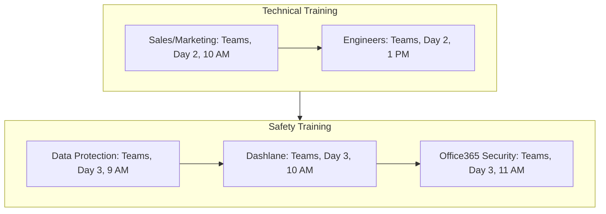

<Note>Last Updated: February 25, 2025</Note>

## Purpose
To provide role-specific skills and technical training, ensuring new employees are competent and comply with security standards in a fully remote setting.

## Scope
Applies to HR and IT for training sales, marketing, and software engineers at Koodall.

## Responsibility
IT leads technical training; HR oversees safety training.

## Simple Flowchart

<Frame>

</Frame>

## Process Steps
<Steps>
  <Step title="1. Company Introduction">
    - HR hosts a 1-hour Teams call at 9 AM, including:
      - Present mission (e.g., "Innovate AR/video tools")
      - Present products (e.g., "Amadeus SDK")
      - Present culture (e.g., "Collaboration first")
      - Share slide deck from SharePoint (e.g., "HR/Intro-2025-V1.pptx"), record session
      - Allow 15-min Q&A, end by 10 AM
  </Step>

  <Step title="2. Team Meet-and-Greet">
    - Team lead schedules a 30-min Teams call by 11 AM, including:
      - Introduce key members (e.g., "Mike, Sales Lead")
      - Post welcome in Slack (e.g., "#sales: Welcome Jane!") with team bios by 10:30 AM
      - Assign buddy (e.g., "Sarah, marketer") for 1st-week support, notify via Slack
  </Step>

  <Step title="3. Basic Training">
    - HR shares product overview doc from SharePoint (e.g., "Products-Overview-2025.docx") by 10 AM
    - Team lead hosts a 1-hour Teams call at 2 PM, including:
      - Explain duties (e.g., "Log leads in HubSpot")
      - Set 30-day goals (e.g., "Learn Glow basics")
      - Send recording and doc link via Slack by 3 PM
  </Step>
</Steps>

## Tools
<CardGroup cols={1}>
  <Card title="Key Tools" icon="wrench">
    - **Microsoft Teams**: Video meetings for introductions and training
    - **SharePoint**: Storage for slide decks and documents
    - **Slack**: Internal communication and notifications
  </Card>
</CardGroup>

<Warning>
  Ensure all Day 1 activities are completed on time to avoid delays. Escalate technical issues via Slack `#hr-support` within 1 hour.
</Warning>

## Notes
<CardGroup cols={2}>
  <Card title="Remote Focus" icon="globe">
    All actions are tailored for fully remote employees, leveraging digital tools for engagement.
  </Card>
  <Card title="Integration" icon="link">
    Coordinate with HR_Pre_Onboarding_Preparation_SOP to ensure pre-Day 1 setup is complete (e.g., equipment, permissions).
  </Card>
</CardGroup>