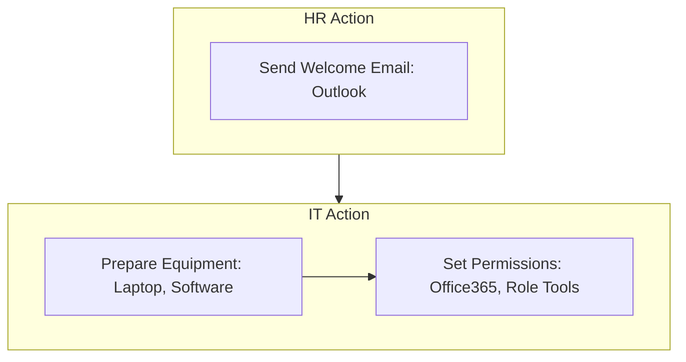

<Note>Last Updated: February 25, 2025</Note>

## Purpose
To ensure new employees receive essential information, equipment, and system access before their first day, enabling a smooth start in a fully remote environment.

## Scope
  Applies to HR and IT for all remote hires (sales, marketing, software engineers) at Koodall.

## Responsibility
  HR coordinates preparation; IT handles equipment and permissions.

## Simple Flowchart

<Frame>

</Frame>
## Process Steps
<Steps>
  <Step title="Send Welcome Email">
    - HR sends email via Outlook 3 days before the onboarding date, including:
      - Company intro (e.g., “Welcome to Koodall!”).
      - Start date (e.g., "March 1, 2025")
      - Day 1 agenda (e.g., "9 AM Teams call")
      - Employee handbook link (TBD)
      - NDA signature request via SharePoint DocuSign link (due by 11PM on 2 day before the onboarding date)
    - Attach SharePoint URL to "New Hire Guide" (TBD)
    - CC manager and IT, confirm receipt 2 days before the onboarding date.
  </Step>

  <Step title="Prepare Work Equipment (TBD)">
    - (TBD) IT orders laptop (e.g., MacBook Pro) via procurement 5 days before the onboarding date, ships via FedEx to employee address 2 days before the onboarding date.
    - Pre-install software:
      - Office365 (Teams, Outlook)
      - Slack
    - Test boot-up and apps, log serial number (e.g., “MBP-12345”) in IT asset tracker 1 day before the onboarding date.
  </Step>

  <Step title="Set System Permissions">
    - IT creates Office365 account (e.g., jane.doe@koodall.ai) in Azure AD 1 day before the onboarding date, sets up email and SharePoint access.
    - Assign role-based tools:
      - Sales/Marketing get Intercom (chat dashboard), HubSpot (CRM)
      - Engineers get GitHub (repo access)
    - Enable and verify 2FA on Office365 and Slack via Azure AD 1 day before the onboarding date.
    - Verify access in Slack #it-ops (e.g., “Jane’s permissions set, 2FA active”), complete by end of day 1 day before the onboarding date.
  </Step>
</Steps>

## Tools
<CardGroup cols={1}>
  <Card title="Key Tools" icon="wrench">
    - **Office365 (Outlook, Azure AD)**: Email, account setup, permissions
    - **SharePoint**: Storage for guides and assets
    - **Slack**: Internal communication for status updates
    - **FedEx**: Equipment shipping and tracking
  </Card>
</CardGroup>

<Warning>
  Ensure all deadlines are met to avoid delays in onboarding. Escalate issues via Slack `#hr-support` within 2 hours.
</Warning>
