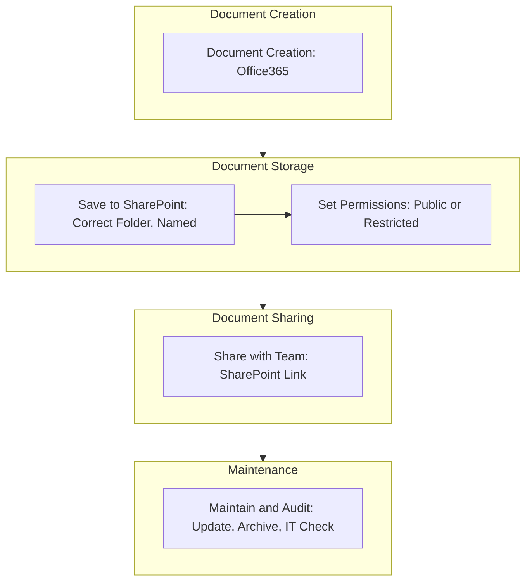

<Note>Last Updated: February 25, 2025</Note>

## Purpose
To ensure SharePoint documents are organized, up-to-date, and easily accessible.

## Scope
Applies to all employees creating or managing documents.

## Responsibility
Employees store and share; IT oversees SharePoint compliance.

## Simple Flowchart
<Frame>

</Frame>

## Process Steps
<Steps>
  <Step title="Document Creation">
    - Create documents in Office365 (e.g., Word, Excel) for policies, processes, or projects:
      - Draft locally
      - Upload to SharePoint within 1 day of completion
  </Step>

  <Step title="Save to SharePoint">
    - Save in the correct library/folder (e.g., HR for policies, Projects for deliverables):
      - Use naming format: `[Department]-[Type]-[Date]-[Version]` (e.g., `IT-SOP-20250225-V1`)
      - Check for duplicates before uploading
  </Step>

  <Step title="Set Permissions">
    - Public docs:
      - Set to "Everyone" in SharePoint (e.g., company handbook)
    - Confidential docs:
      - Restrict to specific teams (e.g., Finance) or individuals (e.g., CFO)
      - Verify permissions in SharePoint settings within 2 hours of upload
  </Step>

  <Step title="Share with Team">
    - Generate a SharePoint link (view or edit) via the "Share" button:
      - Send link via Slack or email, avoiding file attachments
      - Notify team within 1 day of upload
  </Step>

  <Step title="Maintain and Audit">
    - Review docs every 6 months for updates (e.g., revise SOPs):
      - Archive outdated docs to "Archive" folder (e.g., `IT-SOP-2023-V1-Archived`)
      - IT audits naming, permissions, and duplicates quarterly
  </Step>
</Steps>

## Tools
<CardGroup cols={1}>
  <Card title="Key Tools" icon="wrench">
    - **Office365 (Word, Excel)**: Document creation and drafting
    - **SharePoint**: Document storage, naming, permissions, and archiving
    - **Slack**: Internal communication for sharing links
    - **Email**: Notification for document sharing (optional)
  </Card>
</CardGroup>

<Warning>
  Ensure all documents are properly named, stored, and audited to maintain organization.
  Escalate permission or duplicate issues via Slack `#it-support` within 1 hour.
</Warning>

## Notes
<CardGroup cols={2}>
  <Card title="Organization Focus" icon="folder">
    Prioritize clear naming and folder structure to ensure accessibility for all employees.
  </Card>
  
  <Card title="Integration" icon="link">
    Coordinate with [IT_Infrastructure_Management_SOP](SOP/IT/IT_Infrastructure_Management_SOP.mdx) to ensure SharePoint infrastructure supports document management (e.g., storage capacity, permissions setup).
  </Card>
</CardGroup>

