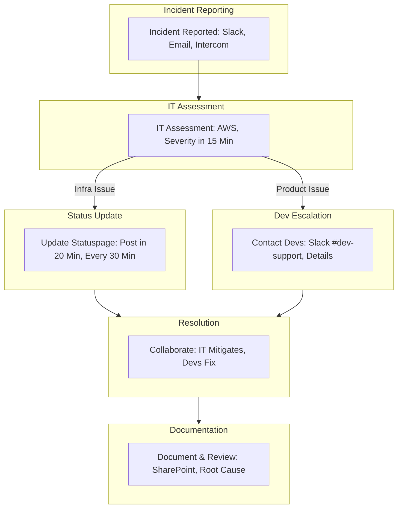

<Note>Last Updated: February 25, 2025</Note>

## Purpose
To enable IT to respond quickly to emergencies, stabilize infrastructure, communicate transparently via Statuspage, and collaborate with developers to resolve issues.

## Scope
Applies to IT for infrastructure and Statuspage; developers for product fixes.

## Responsibility
IT leads response and communication; developers support service issues.

## Simple Flowchart

## Process Steps
<Steps>
  <Step title="Incident Reported">
    - Receive reports via Slack `#it-incident`, email `it-support@koodall.ai`, Intercom user feedback, or AWS alerts:
      - Check Statuspage comments for user-reported issues every 4 hours
      - Log initial report with timestamp and source within 10 minutes
  </Step>

  <Step title="IT Initial Assessment">
    - Check AWS CloudWatch (e.g., CPU, latency) or service dashboards (e.g., Atlassian, Auth0) within 15 minutes:
      - Identify if issue is infrastructure (e.g., AWS outage) or product-related (e.g., login failure)
      - Assign severity:
        - Minor (few users)
        - Major (all users)
  </Step>

  <Step title="Update Statuspage">
    - Log into Statuspage admin panel within 20 minutes of assessment:
      - Post update: “Investigating” (minor), “Issue Identified” (major), with brief description (e.g., “Login issues reported”)
      - Update every 30 minutes for major issues, 1 hour for minor, using pre-set templates
  </Step>

  <Step title="Contact Development Team">
    - Notify developers via Slack `#dev-support` and email within 10 minutes if product-related:
      - Share details: issue (e.g., “Atlassian login failed”), scope (e.g., “all users”), diagnosis (e.g., “Auth0 suspected”), and Statuspage link
      - Request ETA or support within 1 hour
  </Step>

  <Step title="Collaborate to Resolve">
    - IT shares AWS logs, mitigates (e.g., switches to backup server) within 2 hours, updates Statuspage:
      - Developers diagnose (e.g., code bug) and fix or provide ETA within 4 hours
      - Communicate via Slack thread, resolve issue, confirm with test (e.g., login works)
  </Step>

  <Step title="Document and Review">
    - Log in SharePoint: timeline, impact, steps, resolution within 1 day of fix:
      - Hold 30-minute review with developers within 1 week to find root cause
      - Update SOP with lessons (e.g., add backup steps), store in Notion
  </Step>
</Steps>

## Tools
<CardGroup cols={1}>
  <Card title="Key Tools" icon="wrench">
    - **AWS CloudWatch**: Monitoring for alerts and anomalies
    - **Slack**: Internal communication for incident reporting and escalations
    - **Intercom**: User feedback collection
    - **Statuspage**: Transparent communication for updates
    - **SharePoint**: Documentation storage for incidents and reviews
    - **Notion**: SOP updates and storage
    - **Email**: Notifications for developers and IT support
  </Card>
</CardGroup>

<Warning>
  Ensure all emergency responses are completed promptly to minimize downtime.
  Escalate critical issues via Slack `#it-support` within 1 hour.
</Warning>

## Notes
<CardGroup cols={2}>
  <Card title="Emergency Focus" icon="alert">
    Prioritize rapid response and communication to maintain Koodall’s infrastructure stability.
  </Card>
  
  <Card title="Integration" icon="link">
    Coordinate with [IT_Infrastructure_Management_SOP](SOP/IT/IT_Infrastructure_Management_SOP.mdx) to ensure AWS monitoring aligns with ongoing infrastructure stability (e.g., backups, security policies).
  </Card>
</CardGroup>

