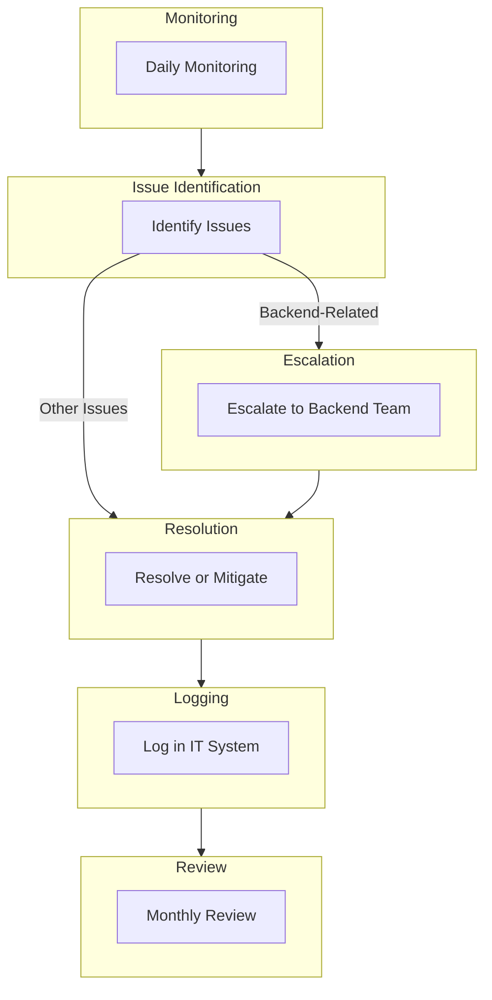

<Note>Last Updated: February 25, 2025</Note>

## Purpose
To ensure the stability, security, and compliance of the AWS environment.

## Scope
Applies to IT department, with escalation to backend team as needed.

## Responsibility
IT monitors and manages AWS; backend team handles service-specific issues.

## Simple Flowchart

## Process Steps
<Steps>
  <Step title="Daily Monitoring">
    - IT checks AWS CloudWatch for alerts, anomalies, and resource health:
      - Review metrics like CPU usage, memory, and network traffic
  </Step>

  <Step title="Identify Issues">
    - Review security groups, tags, backups, and usage patterns for problems:
      - Examples include unauthorized access or resource overuse
  </Step>

  <Step title="Escalate if Needed">
    - Critical backend issues go to the backend team:
      - Notify via Slack `#backend-support` within 1 hour
    - Other issues are handled by IT:
      - Assign and track internally in IT system
  </Step>

  <Step title="Resolve or Mitigate">
    - Fix issues (e.g., adjust security, scale resources):
      - Document actions taken (e.g., "Scaled EC2 instance to handle load")
      - Log details in the IT incident system within 24 hours
  </Step>

  <Step title="Monthly Review">
    - Optimize costs:
      - Analyze AWS billing and adjust resources as needed
    - Update security policies:
      - Ensure compliance with standards (e.g., GDPR, SOC 2)
    - Conduct quarterly audit of AWS configuration and compliance
  </Step>
</Steps>

## Tools
<CardGroup cols={1}>
  <Card title="Key Tools" icon="wrench">
    - **AWS CloudWatch**: Monitoring for alerts, anomalies, and resource health
    - **Slack**: Internal communication for escalations and updates
    - **IT Incident System**: Logging and tracking issues and resolutions
  </Card>
</CardGroup>

<Warning>
  Ensure all infrastructure activities are completed on schedule to maintain system stability.
  Escalate critical issues via Slack `#it-support` within 1 hour.
</Warning>

## Notes
<CardGroup cols={2}>
  <Card title="Stability Focus" icon="server">
    Prioritize AWS stability and security to support Koodall's remote operations.
  </Card>
  
  <Card title="Integration" icon="link">
    Coordinate with [IT_Document_and_Knowledge_Management_SOP](SOP/IT/IT_Document_and_Knowledge_Management_SOP.mdx) to ensure infrastructure supports document management (e.g., SharePoint storage, backups).
  </Card>
</CardGroup>