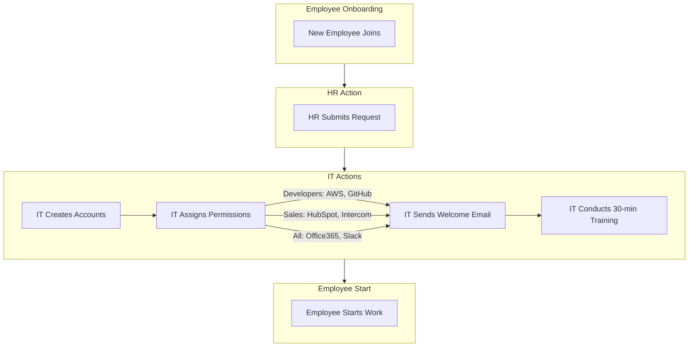

<Note>Last Updated: February 25, 2025</Note>

## Purpose
To ensure new employees quickly gain access to necessary tools and understand how to use them effectively.

## Scope
Applies to HR and IT departments for all new hires.

## Responsibility
HR submits requests; IT manages account creation and onboarding.

## Simple Flowchart

## Process Steps
<Steps>
  <Step title="HR Submits Request">
    - HR sends a completed form with employee details (name, role, department, start date) to IT:
      - Submit at least 2 days before the start date
  </Step>

  <Step title="IT Creates Accounts">
    - IT sets up accounts in Office365, Slack, Intercom, HubSpot, and role-specific tools (e.g., AWS, GitHub) within 1 business day:
      - Create accounts for email, chat, CRM, and repositories or cloud services
  </Step>

  <Step title="IT Assigns Permissions">
    - IT configures permissions based on predefined role templates:
      - *Developers*: Access to AWS (e.g., EC2, S3 buckets) and GitHub repositories (read/write per project)
      - *Sales Team*: Access to HubSpot (CRM dashboards, deal tracking) and Intercom (customer chat)
      - *All Employees*: Full access to Office365 (email, Teams, SharePoint) and Slack (all public channels)
    - Permissions are verified against a checklist
  </Step>

  <Step title="IT Sends Welcome Email">
    - Email includes login credentials, tool-specific guides (e.g., Slack PDF, HubSpot video), and IT support contact (email/phone):
      - Send within 1 business day of account creation
  </Step>

  <Step title="IT Conducts Training">
    - 30-minute session (virtual or in-person) covering tool basics, role-specific features, and Q&A:
      - Use Teams or Zoom for virtual training on the start date
  </Step>

  <Step title="Employee Starts Work">
    - New hire begins using tools with full access and ongoing IT support:
      - Confirm tool functionality on start date, escalate issues via Slack `#it-support`
  </Step>
</Steps>

## Tools
<CardGroup cols={1}>
  <Card title="Key Tools" icon="wrench">
    - **Office365**: Account creation for email, Teams, and SharePoint
    - **Slack**: Communication and onboarding support
    - **Intercom**: Customer support access for sales
    - **HubSpot**: CRM access for sales
    - **AWS**: Cloud access for developers
    - **GitHub**: Repository access for developers
    - **Microsoft Teams/Zoom**: Virtual training sessions
  </Card>
</CardGroup>

<Warning>
  Ensure all onboarding steps are completed on schedule to avoid delays.
  Escalate access or training issues via Slack `#it-support` within 1 hour.
</Warning>

## Notes
<CardGroup cols={2}>
  <Card title="Onboarding Focus" icon="user-plus">
    Prioritize quick tool access and training to support new hires effectively in a remote environment.
  </Card>
  
  <Card title="Integration" icon="link">
    Coordinate with [HR_Pre_Onboarding_Preparation_SOP](SOP/HR/HR_Pre_Onboarding_Preparation_SOP.mdx) to ensure pre-onboarding setup aligns with user onboarding (e.g., equipment, permissions).
  </Card>
</CardGroup>
