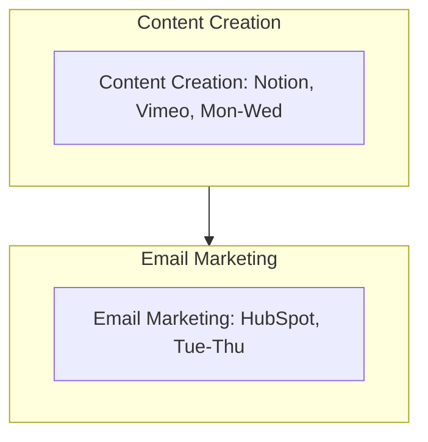

<Note>Last Updated: February 25, 2025</Note>

## Purpose
To enhance Koodall AI's brand image and attract potential SME clients through high-quality content.

## Scope
Applies to marketing team creating and distributing content for SMEs (10-500 employees).

## Responsibility
Content creators produce materials; marketing manager ensures brand consistency.

## Simple Flowchart
<Frame>

</Frame>

## Process Steps
<Steps>
  <Step title="Content Creation">
    - Plan in Notion by Monday 9 AM:
      - Outline 3 pieces/week (e.g., "Glow demo video")
      - Align with brand (e.g., "Low-cost AI")
    - Create videos (e.g., "TechShop Case: 50% faster AR") in 2 days, upload to Vimeo by Wednesday 3 PM
    - Embed Vimeo links on site (e.g., [koodall.ai/glow](http://koodall.ai/glow)) and LinkedIn/X by Friday 10 AM, save plan in SharePoint
  </Step>

  <Step title="Email Marketing">
    - Design in HubSpot by Tuesday 1 PM:
      - Newsletter (e.g., "AI Tips + Amadeus Update"), 500 SME leads targeted
    - Send via HubSpot on Thursday 9 AM, track opens (e.g., "20% rate") and clicks (e.g., "50 demo links") by Friday
    - Log results in SharePoint (e.g., "Email-Q1-2025.xlsx") by Friday EOD, tag manager for review
  </Step>
</Steps>

## Tools
<CardGroup cols={1}>
  <Card title="Key Tools" icon="wrench">
    - **Notion**: Planning and collaboration for content creation
    - **Vimeo**: Hosting for video content
    - **HubSpot**: Email marketing and lead targeting
    - **SharePoint**: Storage for plans and results
    - **LinkedIn/X**: Social media distribution for content
  </Card>
</CardGroup>

<Warning>
  Ensure all content and email campaigns are completed on schedule to maintain brand momentum.
  Escalate technical issues via Slack `#marketing-support` within 1 hour.
</Warning>

## Notes
<CardGroup cols={2}>
  <Card title="SME Focus" icon="target">
    Target SMEs with content emphasizing Koodall's low-cost, high-efficiency AI solutions to drive engagement.
  </Card>
  
  <Card title="Integration" icon="link">
    Coordinate with [Marketing_Marketing_Strategy_SOP](SOP/Marketing/Marketing_Marketing_Strategy_SOP.mdx) to ensure content aligns with broader market positioning (e.g., AI trends, competitor analysis).
  </Card>
</CardGroup> 