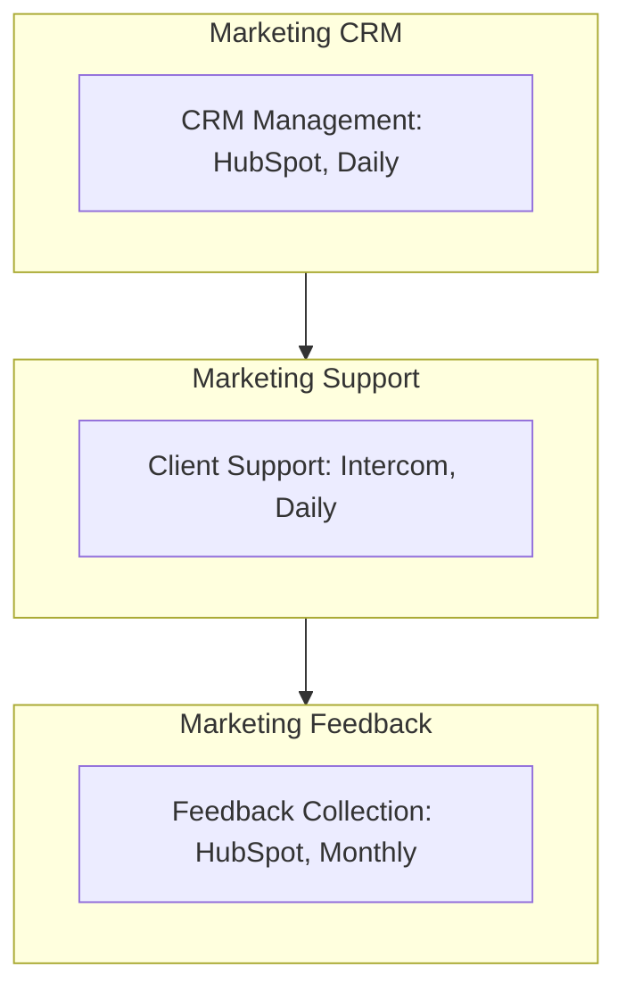

<Note>Last Updated: February 25, 2025</Note>

## Purpose
To maintain client relationships, convert sales leads, and improve retention for Koodall AI's SME clients.

## Scope
Applies to marketing team managing SME interactions (10-500 employees) post-engagement.

## Responsibility
Marketing team tracks and supports clients; manager reviews CRM and feedback.

## Simple Flowchart
<Frame>

</Frame>

## Process Steps
<Steps>
  <Step title="CRM Management">
    - Update HubSpot daily at 9 AM:
      - Log interactions (e.g., "TechShop email opened")
      - Move leads (e.g., "Prospect to Opportunity")
      - Tag leads (e.g., "High: AR need"), assign to sales (e.g., "Jane to Mike") by 10 AM
    - Save weekly report (e.g., "CRM-Q1-2025.xlsx") in SharePoint by Friday EOD
  </Step>

  <Step title="Client Support">
    - Monitor Intercom daily at 11 AM:
      - Reply to chats (e.g., "Glow setup help") within 1 hour
      - Escalate tech issues to `#tech-support` Slack (e.g., "@support, FaceAR bug") within 2 hours
      - Log chats in HubSpot (e.g., "TechShop, 3/3, Resolved") by noon
  </Step>

  <Step title="Feedback Collection">
    - Send HubSpot survey monthly on 1st (e.g., "Rate Koodall 1-5"), target 100 clients, due by 7th:
      - Questions like "What's working well?" and "Any issues?"
      - Analyze responses (e.g., "80% happy, 10% want faster support") by 10th, log in SharePoint (e.g., "Feedback-202503.xlsx")
      - Update strategy (e.g., "Add Intercom FAQ"), share in `#marketing` Slack by 15th
  </Step>
</Steps>

## Tools
<CardGroup cols={1}>
  <Card title="Key Tools" icon="wrench">
    - **HubSpot**: CRM tracking, lead management, and survey distribution
    - **Intercom**: Real-time client support and interaction
    - **Slack**: Internal communication for issue escalation and updates
    - **SharePoint**: Storage for reports and feedback
  </Card>
</CardGroup>

<Warning>
  Ensure all CRM, support, and feedback activities are completed on schedule to maintain client engagement.
  Escalate technical issues via Slack `#marketing-support` within 1 hour.
</Warning>

## Notes
<CardGroup cols={2}>
  <Card title="SME Focus" icon="target">
    Focus on SME retention and lead conversion, prioritizing high-value interactions for long-term growth.
  </Card>
  
  <Card title="Integration" icon="link">
    Coordinate with [Marketing_Social_Media_Management_SOP](SOP/Marketing/Marketing_Social_Media_Management_SOP.mdx) to ensure social engagement supports CRM efforts (e.g., lead nurturing, feedback collection).
  </Card>
</CardGroup>
