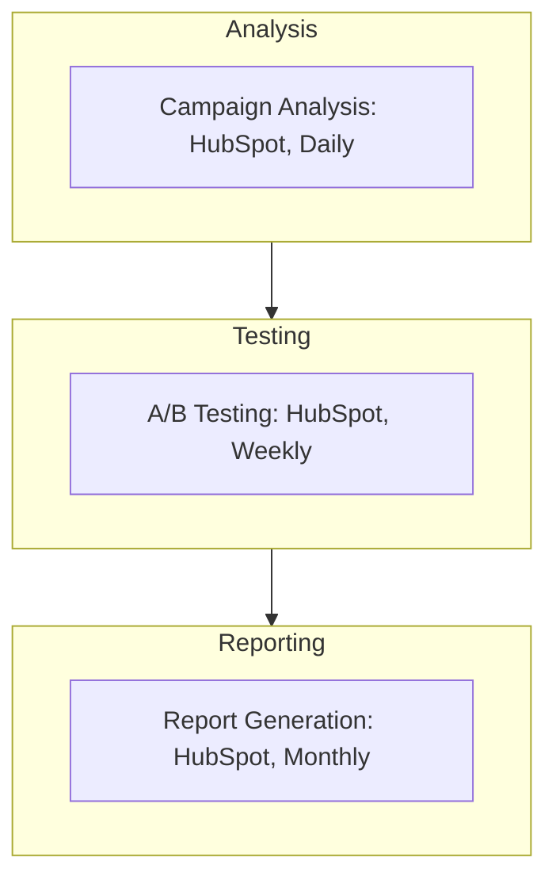

<Note>Last Updated: February 25, 2025</Note>

## Purpose
To optimize marketing strategies and improve ROI through data-driven decisions for Koodall AI's SME campaigns.

## Scope
Applies to marketing team analyzing campaigns for SMEs (10-500 employees).

## Responsibility
Marketing analysts run analysis and tests; manager approves optimizations.

## Simple Flowchart
<Frame>

</Frame>

## Process Steps
<Steps>
  <Step title="Campaign Analysis">
    - Check HubSpot daily at 10 AM:
      - Track email opens (e.g., "20%")
      - Track social reach (e.g., "1k LinkedIn")
      - Track site visits (e.g., "500")
    - Log trends (e.g., "X visuals up 15%") in HubSpot "Campaigns" by 11 AM
    - Save weekly summary in SharePoint (e.g., "Analysis-Q1-2025.xlsx") by Friday 3 PM
  </Step>

  <Step title="A/B Testing">
    - Set up in HubSpot by Monday 1 PM:
      - Test 2 email subjects (e.g., "Try Glow" vs. "Glow Now") for 200 leads
      - Run 7 days, check results (e.g., "Glow Now: 25% open") by next Monday 10 AM
      - Pick winner (e.g., "Glow Now"), update template in HubSpot by Tuesday EOD
  </Step>

  <Step title="Report Generation">
    - Build HubSpot report monthly on 5th (e.g., "March 2025: 5k reach, 10% ROI"), analyze in 2 hours:
      - Adjust strategy (e.g., "More Instagram ads")
      - Save as "Report-202503.docx" in SharePoint by 7th
      - Share with team in `#marketing` Slack (e.g., "Q1 ROI up 12%") by 8th
  </Step>
</Steps>

## Tools
<CardGroup cols={1}>
  <Card title="Key Tools" icon="wrench">
    - **HubSpot**: Campaign tracking, A/B testing, and report generation
    - **SharePoint**: Storage for summaries and reports
    - **Slack**: Internal communication for sharing results
  </Card>
</CardGroup>

<Warning>
  Ensure all analysis, testing, and reporting activities are completed on schedule to maximize ROI.
  Escalate data issues via Slack `#marketing-support` within 1 hour.
</Warning>

## Notes
<CardGroup cols={2}>
  <Card title="SME Focus" icon="target">
    Focus on SME campaign performance to drive lead generation and retention for high ROI.
  </Card>
  
  <Card title="Integration" icon="link">
    Coordinate with [Marketing_Data_Analysis_and_Optimization_SOP](SOP/Marketing/Marketing_Data_Analysis_and_Optimization_SOP.mdx) to ensure ongoing optimization aligns with broader marketing strategies (e.g., A/B test results, campaign adjustments).
  </Card>
</CardGroup>
