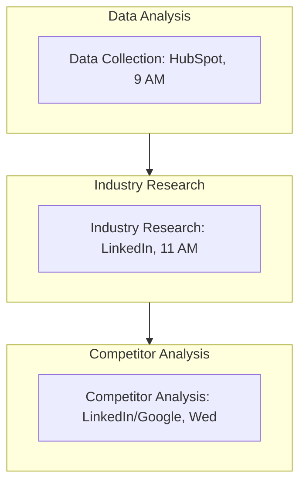

<Note>Last Updated: February 25, 2025</Note>

## Purpose
To deeply understand the target market and client needs, enabling precise positioning of Koodall AI's market strategy for SMEs.

## Scope
Applies to marketing team researching SMEs (10-500 employees) for B2B AI solutions.

## Responsibility
Marketing analysts handle data and research; marketing manager reviews insights.

## Simple Flowchart
<Frame>

</Frame>

## Process Steps
<Steps>
  <Step title="Data Collection and Analysis">
    - Use HubSpot daily at 9 AM:
      - Pull CRM data (e.g., "50 leads, retail, AR interest")
      - Track behavior (e.g., "Visited /glow 3x")
      - Run "Contacts Report" (e.g., "Q1: 200 SMEs, 60% tech"), analyze preferences (e.g., "Low-cost AR"), log by 10 AM
    - Save findings in SharePoint (e.g., "Data-Q1-2025.xlsx") by Friday EOD
  </Step>

  <Step title="Industry Research">
    - Search LinkedIn at 11 AM:
      - "AI + [industry]" (e.g., "AI media SMEs"), filter 10-500 employees, 2 hours/week
      - Note trends (e.g., "Video editing up 30%") and SMEs (e.g., "MediaCo"), save 5-10 prospects in "My Network"
      - Summarize in HubSpot note (e.g., "Media trend: AI speed") by noon weekly
  </Step>

  <Step title="Competitor Analysis">
    - Research 3 competitors (e.g., "ARCorp") via LinkedIn/Google by Wednesday 1 PM:
      - Check strategy (e.g., "High-end AR")
      - Identify Koodall edge (e.g., "$500 vs. $2k/month"), draft 1-page report (e.g., "Comp-2025.docx")
      - Upload to SharePoint "Marketing/Research" by Friday 3 PM, tag manager for review
  </Step>
</Steps>

## Tools
<CardGroup cols={1}>
  <Card title="Key Tools" icon="wrench">
    - **HubSpot**: CRM data collection and analysis
    - **LinkedIn**: Industry research and prospect identification
    - **Google**: Competitor analysis and report sourcing
    - **SharePoint**: Storage for findings and reports
  </Card>
</CardGroup>

<Warning>
  Ensure all research and analysis activities are completed on schedule to inform market positioning.
  Escalate data discrepancies via Slack `#marketing-support` within 1 hour.
</Warning>

## Notes
<CardGroup cols={2}>
  <Card title="SME Focus" icon="target">
    Focus on SME market insights to drive precise positioning for Koodall's AI solutions.
  </Card>
  
  <Card title="Integration" icon="link">
    Coordinate with [Marketing_Marketing_Strategy_SOP](SOP/Marketing/Marketing_Marketing_Strategy_SOP.mdx) to ensure research aligns with strategic goals (e.g., AI trends, competitive advantages).
  </Card>
</CardGroup>
