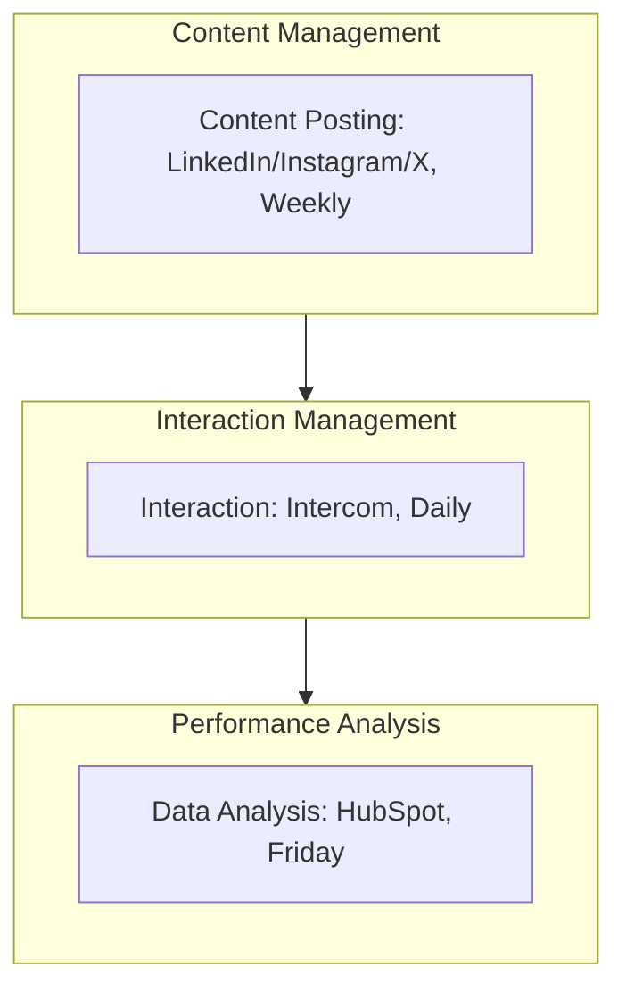

<Note>Last Updated: February 25, 2025</Note>

## Purpose
To boost Koodall AI's brand exposure and increase user interaction through social media platforms.

## Scope
Applies to marketing team managing content and engagement for SMEs (10-500 employees).

## Responsibility
Social media team posts and interacts; marketing manager analyzes performance.

## Simple Flowchart
<Frame>

</Frame>

## Process Steps
<Steps>
  <Step title="Content Posting">
    - Post on LinkedIn 2x/week (e.g., Tuesday/Thursday 10 AM):
      - Insights (e.g., "AI Trends 2025")
      - Updates (e.g., "Glow v2 out")
    - Share on Instagram/X 3x/week (e.g., Mon/Wed/Fri 9 AM):
      - Visuals (e.g., "FaceAR demo pic")
      - Stories (e.g., "Team behind Amadeus")
    - Schedule via Buffer, save drafts in SharePoint (e.g., "Social-Q1-2025.docx") by Monday EOD
  </Step>
  
  <Step title="Interaction Management">
    - Monitor Intercom daily at 11 AM:
      - Reply to LinkedIn/X comments (e.g., "Great Q! Glow starts at $500") within 2 hours
      - Handle Instagram DMs (e.g., "How's setup?") via Intercom, log chats in HubSpot by noon
      - Escalate support issues to `#tech-support` Slack (e.g., "@support, X user bug") within 1 hour
  </Step>
  
  <Step title="Data Analysis">
    - Analyze in HubSpot weekly on Friday 1 PM:
      - Track reach (e.g., "LinkedIn: 1k views")
      - Track engagement (e.g., "X: 50 likes")
      - Adjust strategy (e.g., "More visuals on X"), log in "Social-Report-2025.xlsx" on SharePoint by 3 PM
      - Review with manager, update plan in SharePoint (e.g., "Q1-Update-2025.docx") by EOD
  </Step>
</Steps>

## Tools
<CardGroup cols={1}>
  <Card title="Key Tools" icon="wrench">
    - **LinkedIn**: Professional content posting
    - **Instagram/X**: Brand promotion through visuals and stories
    - **Intercom**: Real-time client interaction and support
    - **HubSpot**: Performance analysis and tracking
    - **Buffer**: Scheduling for social media posts
    - **SharePoint**: Storage for plans and reports
    - **Slack**: Internal communication for escalations
  </Card>
</CardGroup>

<Warning>
  Ensure all social media activities are completed on schedule to maintain brand visibility.
  Escalate technical issues via Slack `#marketing-support` within 1 hour.
</Warning>

## Notes
<CardGroup cols={2}>
  <Card title="SME Focus" icon="target">
    Target SMEs with engaging social content to drive brand awareness and interaction.
  </Card>
  
  <Card title="Integration" icon="link">
    Coordinate with [Marketing_Brand_Building_and_Content_Marketing_SOP](SOP/Marketing/Marketing_Brand_Building_and_Content_Marketing_SOP.mdx) to ensure social media aligns with content strategy (e.g., video embeds, brand messaging).
  </Card>
</CardGroup>
