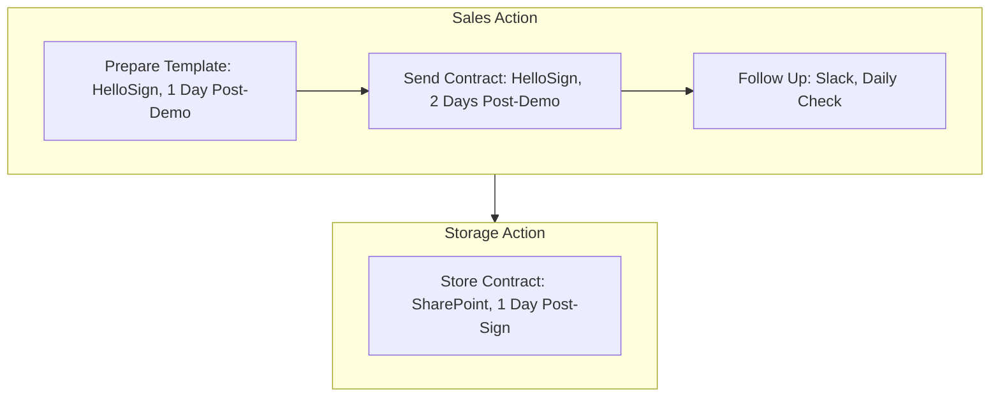

<Note>Last Updated: February 25, 2025</Note>

## Purpose
To simplify the contract process and secure deals quickly for Koodall’s B2B software sales.

## Scope
Applies to sales reps negotiating contracts with SMEs (10-500 employees).

## Responsibility
Sales reps manage contract prep and follow-up; sales manager approves adjustments.

## Simple Flowchart
<Frame>

</Frame>

## Process Steps
<Steps>
  <Step title="1. First Week Check-In">
    - Schedule a 30-min Teams call on Day 5 at 10 AM:
      - Ask about adaptation (e.g., “How's Slack working?”)
      - Post summary in Slack (e.g., “#hr-updates: Jane's Day 5 check-in done”) by 11 AM
      - Note issues (e.g., “Needs GitHub help”) and assign follow-up (e.g., IT) by Day 6
  </Step>

  <Step title="2. First Month Goal Setting">
    - Set 3-5 short-term goals in Team Task by Day 10, due by Day 30:
      - Tailor goals to role (e.g., “Learn Glow basics for engineers”)
      - Review progress in a 30-min Teams call on Day 20 at 2 PM
      - Notify HR via Slack (e.g., “#team-leads: Jane's goals on track”) by Day 21
  </Step>

  <Step title="3. First Month Feedback Collection">
    - Send Forms survey by Day 25, due by Day 30:
      - Questions like “What's working well?” and “Suggestions for improvement?”
      - Store responses in SharePoint by Day 31
      - Review feedback and adjust SOP as needed
  </Step>
</Steps>

## Tools
<CardGroup cols={1}>
  <Card title="Key Tools" icon="wrench">
    - **Microsoft Teams**: Video calls for check-ins and goal reviews
    - **Team Task**: Goal tracking and progress monitoring
    - **Slack**: Internal communication for updates and follow-ups
    - **Google Forms**: Surveys for feedback collection
    - **SharePoint**: Storage for feedback and updates
  </Card>
</CardGroup>

<Warning>
  Ensure all follow-up activities are completed on schedule to maintain employee engagement. Escalate issues via Slack `#hr-support` within 1 hour.
</Warning>

## Notes
<CardGroup cols={2}>
  <Card title="Remote Focus" icon="globe">
    All follow-up is tailored for fully remote employees, using digital tools for communication and tracking.
  </Card>
  <Card title="Integration" icon="link">
    Coordinate with [Onboarding Training](SOP/HR/Onboarding_Training.mdx) to ensure training outcomes inform follow-up goals (e.g., tool proficiency, security adherence).
  </Card>
</CardGroup>