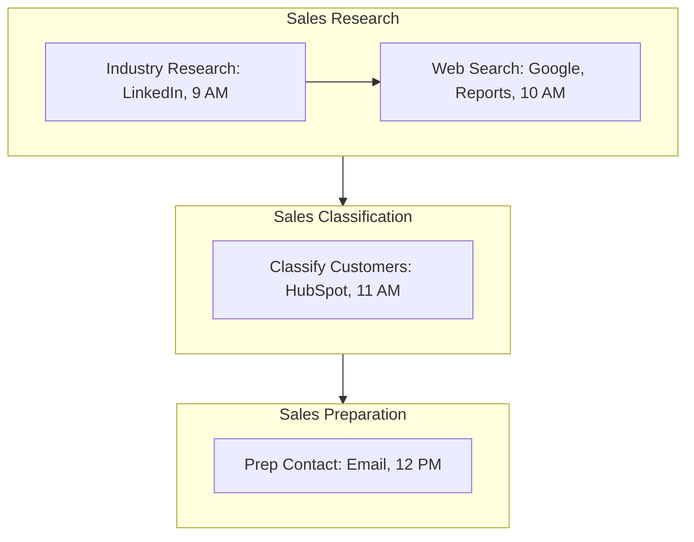

<Note>Last Updated: February 25, 2025</Note>

## Purpose
To identify potential SME clients and understand their AI needs for Koodall’s B2B software sales.

## Scope
Applies to sales reps targeting SMEs (10-500 employees) with AI solution needs.

## Responsibility
Sales reps conduct research and prepare outreach; sales manager reviews HubSpot data.

## Flowchart
<Frame>

</Frame>

## Process Steps
<Steps>
  <Step title="1. Industry Research">
    - Use LinkedIn daily at 9 AM:
      - Search “AI + [industry]” (e.g., “AI retail”), filter SMEs (10-500 employees)
      - Check company pages (e.g., “TechShop”) for AI pain points (e.g., “Slow video processing”)
      - Note 5-10 prospects/day, save in LinkedIn “My Network”
  </Step>

  <Step title="2. Web Search">
    - Google “AI needs [industry]” (e.g., “AI needs e-commerce”) and scan reports (e.g., Gartner) by 10 AM:
      - Identify 3-5 SMEs with AI interest (e.g., “AR for product demos”), log URLs in notes
      - Cross-check with LinkedIn findings, aim for 2 hours/week
  </Step>

  <Step title="3. Customer Classification">
    - Enter prospects in HubSpot by 11 AM:
      - Fields include industry (e.g., “Retail”), size (e.g., “50 employees”), AI need (e.g., “Fast AR”)
      - Tag as “High” (urgent need), “Medium” (exploring), “Low” (future potential), update daily
      - Assign to pipeline stage “Prospect” with notes (e.g., “TechShop: Video SDK interest”)
  </Step>

  <Step title="4. Contact Preparation">
    - Draft outreach email in Koodall email by 12 PM:
      - Use template (e.g., “Boost efficiency with Koodall AI, $500/month”)
      - Personalize with prospect data (e.g., “Saw TechShop’s AR push”), save as draft
      - Aim for 5 emails/day, reviewed by manager in HubSpot by EOD
  </Step>
</Steps>

## Tools
<CardGroup cols={1}>
  <Card title="Key Tools" icon="wrench">
    - **LinkedIn**: Prospect research and industry analysis
    - **HubSpot**: Lead tracking and classification
    - **Koodall Email**: Client outreach and communication
    - **Google**: Web search for reports and trends
  </Card>
</CardGroup>

<Warning>
  Ensure all prospecting activities are completed daily to maintain lead pipeline momentum. Escalate data issues via Slack `#sales-support` within 1 hour.
</Warning>

## Notes
<CardGroup cols={2}>
  <Card title="SME Focus" icon="target">
    Target SMEs with clear AI needs, prioritizing high-urgency leads for rapid outreach.
  </Card>
  <Card title="Integration" icon="link">
    Coordinate with [Sales_Sales_Demonstration_SOP](SOP/Sales/Sales_Sales_Demonstration_SOP.mdx) to ensure qualified leads transition seamlessly into demos (e.g., verified AI needs, readiness).
  </Card>
</CardGroup>
