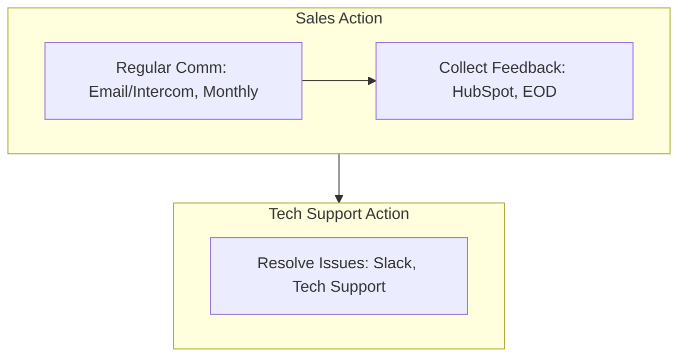
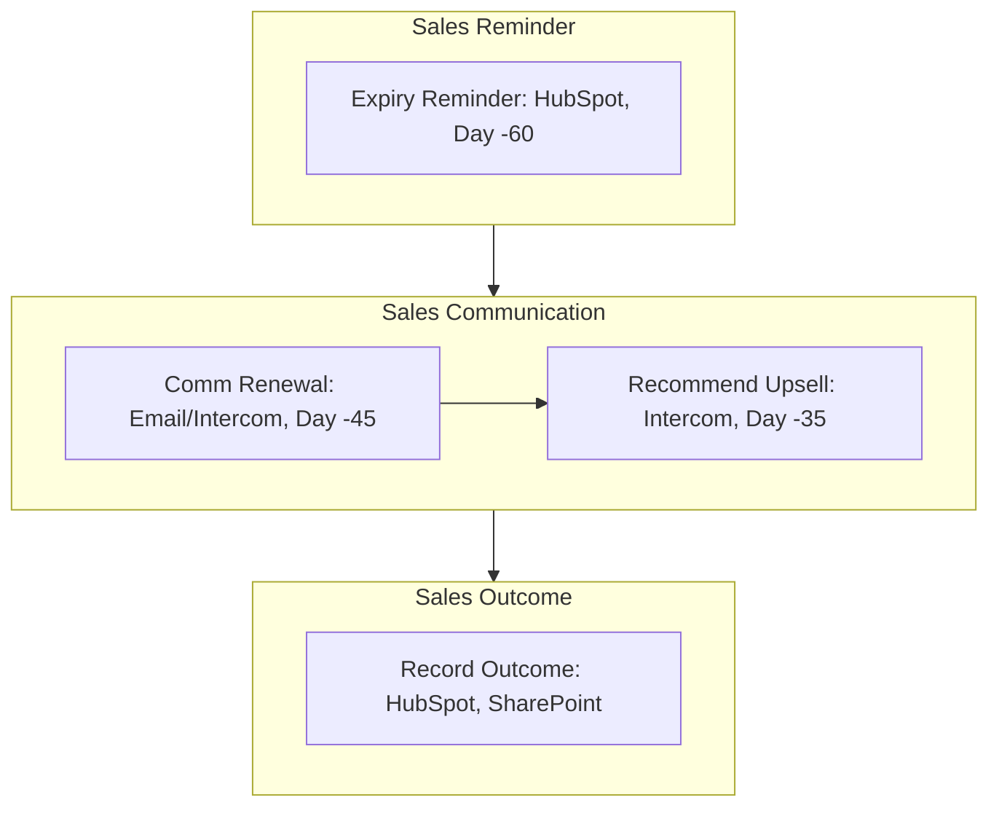

<Note>Last Updated: February 25, 2025</Note>

## Purpose
To maintain strong client relationships post-sale, ensuring satisfaction, gathering feedback, and driving renewals/upsells for revenue growth.

## Scope
Applies to sales reps managing SME clients (10-500 employees) after contract signing.

## Responsibility
Sales reps handle follow-ups and renewals; Tech Support assists with issues.

## Customer Follow-Up

### Purpose
To check in post-signing, assess product usage, and collect feedback regularly.

### Flowchart
<Frame>

</Frame>

## Process Steps
<Steps>
  <Step title="1. Regular Communication">
    - Email via Koodall Email (e.g., "Hi Jane, how's Glow working?") or Intercom chat on Day 15, then monthly (e.g., 1st of month):
      - Ask 3 questions (e.g., "Ease of use? Issues? Needs?")
      - Reply within 24 hours
      - Log call/chat in HubSpot by EOD (e.g., "TechShop, 3/15")
  </Step>

  <Step title="2. Collect Feedback">
    - Record responses in HubSpot under contact (e.g., "Jane@techshop.com") by EOD:
      - Rate 1-5, notes (e.g., "Loves AR, slow setup")
      - Tag "Positive" or "Needs Work," review weekly with manager
      - Save detailed feedback in SharePoint (e.g., "Feedback-TechShop-20250315.docx") by week's end
  </Step>

  <Step title="3. Resolve Issues">
    - If tech issue (e.g., "Glow crashes"), post in Slack `#tech-support` (e.g., "@support, TechShop bug") within 2 hours:
      - Coordinate fix with Tech Support
      - Update client via Intercom within 24 hours
      - Log resolution in HubSpot (e.g., "Fixed 3/16, new config"), tag "Resolved" by EOD
  </Step>
</Steps>

## Renewal and Upsell

### Purpose
To secure renewals and upsell additional services before contract expiry.

### Flowchart
<Frame>

</Frame>

### Process Steps
<Steps>
  <Step title="1. Contract Expiry Reminder">
    - Set HubSpot task 60 days pre-expiry (e.g., "TechShop, due 9/1/25") with alert on Day -60 (e.g., 7/3/25):
      - Assign to rep, check weekly in "Tasks" view (e.g., Monday 9 AM)
      - Note contract value (e.g., "$10k/year") in task description
  </Step>

  <Step title="2. Communicate Renewal">
    - Email via Koodall Email (e.g., "Jane, your Glow contract ends 9/1—renew?") or Intercom on Day -45, offer call:
      - Propose terms (e.g., "$500/month, 12 months")
    - Reply within 24 hours
    - Log in HubSpot (e.g., "Sent renewal, 7/18"), tag "Renewal Pending"
  </Step>

  <Step title="3. Recommend Upsell">
    - Review usage in HubSpot (e.g., "TechShop uses Glow AR daily") by Day -40:
      - Suggest add-ons (e.g., "FaceAR, $200/month")
    - Pitch via Intercom (e.g., "Jane, FaceAR boosts engagement—demo?") by Day -35
    - Update HubSpot deal (e.g., "Upsell: FaceAR, $2.4k"), link to renewal task
  </Step>

  <Step title="4. Record Outcome">
    - Log result in HubSpot by Day +1 post-expiry (e.g., "Renewed 9/2, $12k") or "Lost," with notes (e.g., "Chose competitor"):
      - Upload signed renewal to SharePoint (e.g., "Contracts/TechShop-20250901.pdf") by Day +2
    - Notify team in Slack `#sales` (e.g., "TechShop renewed, $12k!") by EOD
  </Step>
</Steps>

## Tools
<CardGroup cols={1}>
  <Card title="Key Tools" icon="wrench">
    - **Koodall Email**: Client communication for follow-ups and renewals
    - **Intercom**: Real-time client interaction and support
    - **HubSpot**: Lead tracking, feedback, and renewal management
    - **Slack**: Internal communication for issue resolution and updates
    - **SharePoint**: Storage for feedback and contracts
  </Card>
</CardGroup>

<Warning>
  Ensure all follow-up and renewal activities are completed on schedule to maintain client satisfaction and revenue growth. Escalate technical issues via Slack `#sales-support` within 1 hour.
</Warning>

## Notes
<CardGroup cols={2}>
  <Card title="SME Focus" icon="target">
    Focus on SME retention and growth, prioritizing high-value renewals and upsells.
  </Card>
  <Card title="Integration" icon="link">
    Coordinate with [Sales_Contract_Negotiation_SOP](SOP/Sales/Sales_Contract_Negotiation_SOP.mdx) to ensure signed contracts transition smoothly into follow-up and renewal processes (e.g., contract terms, client readiness).
  </Card>
</CardGroup>