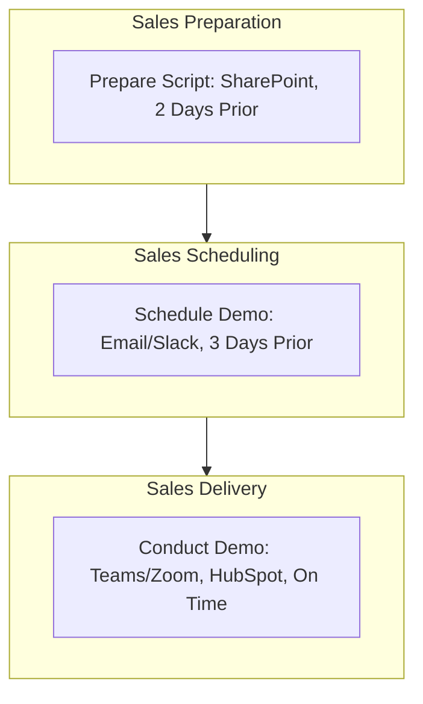

<Note>Last Updated: February 25, 2025</Note>

## Purpose
To showcase Koodall's value to SMEs using standardized demo scripts, emphasizing cost reduction and efficiency.

## Scope
Applies to sales reps conducting B2B demos for SMEs (10-500 employees).

## Responsibility
Sales reps prepare and deliver demos; sales manager reviews scripts and feedback.

## Simple Flowchart
<Frame>

</Frame>

## Process Steps
<Steps>
  <Step title="Prepare Demo Script">
    - Use SharePoint template (e.g., "Sales/Demo-Template-2025.docx") by 2 days before demo:
      - Customize for industry (e.g., "Retail: Glow cuts AR costs by 30%")
      - Highlight AI benefits (e.g., "$500/month vs. $2k")
      - Save as "Demo-[Industry]-[Date]" (e.g., "Demo-Retail-20250305"), upload to SharePoint by EOD
  </Step>
  
  <Step title="Schedule Demo">
    - Email client via Koodall Gmail (e.g., "Subject: TechShop Demo, 3/5") by 3 days prior:
      - Propose 3 times (e.g., "10 AM PST")
      - Confirm via Slack (e.g., "#sales: TechShop demo set 3/5, 10 AM") if internal coordination needed, by 2 days prior
      - Add to HubSpot calendar (e.g., "Demo-TechShop-20250305"), sync with Teams/Zoom link
  </Step>
  
  <Step title="Conduct Demo">
    - Host 30-min session on Teams/Zoom at scheduled time (e.g., 10 AM PST, 3/5):
      - Demo Koodall AI (e.g., "Amadeus edits video in 5s")
      - Record feedback (e.g., "Needs faster setup") and questions (e.g., "Integration time?") live in notes
      - Log in HubSpot under contact (e.g., "TechShop, Jane Smith") by EOD, tag "Demo Done"
  </Step>
</Steps>

## Tools
<CardGroup cols={1}>
  <Card title="Key Tools" icon="wrench">
    - **SharePoint**: Storage for demo scripts and templates
    - **Koodall Gmail**: Client communication for scheduling
    - **HubSpot**: Demo tracking and feedback logging
    - **Slack**: Internal communication for coordination
    - **Microsoft Teams/Zoom**: Video meetings for demos
  </Card>
</CardGroup>

<Warning>
  Ensure all demo preparations and deliveries are completed on schedule to maintain client interest. 
  Escalate technical issues via Slack `#sales-support` within 1 hour.
</Warning>

## Notes
<CardGroup cols={2}>
  <Card title="SME Focus" icon="target">
    Target SMEs with tailored demos emphasizing cost reduction and efficiency to drive engagement.
  </Card>
  
  <Card title="Integration" icon="link">
    Coordinate with [Sales_Customer_Prospecting_SOP](SOP/Sales/Sales_Customer_Prospecting_SOP.mdx) to ensure qualified leads are ready for demos (e.g., verified AI needs, client readiness).
  </Card>
</CardGroup>