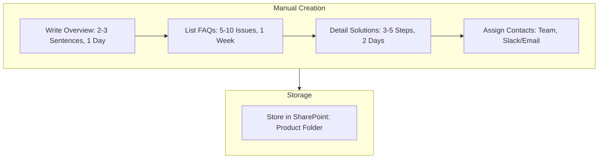

<Note>Last Updated: February 25, 2025</Note>

## Purpose
To provide Tech Support with detailed resources for Koodall products, enabling quick issue identification and resolution.

## Scope
Applies to Tech Support and development teams creating manuals for Amadeus, FaceAR, Glow, Together Engine.

## Responsibility
Tech Support maintains manuals; developers contribute technical content.

## Simple Flowchart
<Frame>

</Frame>

## Process Steps
<Steps>
  <Step title="Write Product Overview">
    - Draft 2-3 sentences on product purpose and features (e.g., "Amadeus: Video editing SDK for mobile apps"):
      - Complete within 1 day of product release, reviewed by product lead
      - Include key use case (e.g., "Real-time video filters")
  </Step>

  <Step title="List Common Issues (FAQ)">
    - Identify 5-10 frequent issues from tickets (e.g., "FaceAR: AR overlay lags") within 1 week of launch:
      - Source from Intercom logs and HubSpot trends, reviewed monthly
      - Categorize by type (e.g., integration, performance)
  </Step>

  <Step title="Detail Solutions">
    - Write step-by-step fixes (e.g., "Glow: API timeout – 1. Check rate limit; 2. Adjust config; 3. Test endpoint"):
      - Limit to 3-5 steps per issue, tested by Tech Support in 2 days
      - Include fallback (e.g., "Escalate to #dev-support if unresolved")
  </Step>

  <Step title="Assign Contacts">
    - List responsible team (e.g., "Together Engine: Backend Devs") and channels (e.g., Slack `#dev-support`, `support@koodall.ai`):
      - Verify contacts with team leads quarterly, update within 1 day
      - Add escalation path (e.g., "Lead Dev: [jane@koodall.ai](mailto:jane@koodall.ai)")
  </Step>

  <Step title="Store in SharePoint">
    - Save as Word doc in SharePoint "Tech Support Knowledge Base" under product folder (e.g., "Amadeus/Manual-V1"):
      - Name file: `[Product]-Manual-[Date]-[Version]` (e.g., "FaceAR-Manual-20250225-V1")
      - Set read access for all Tech Support, upload within 3 days of completion
  </Step>
</Steps>

## Tools
<CardGroup cols={1}>
  <Card title="Key Tools" icon="wrench">
    - **Intercom**: Logs for common issues and feedback
    - **HubSpot**: Ticket trends for identifying frequent issues
    - **SharePoint**: Storage for technical manuals and knowledge base
    - **Slack**: Communication for escalations and contact verification
    - **Email**: Contact information and notifications (e.g., `support@koodall.ai`)
    - **Notion**: SOP updates and storage (optional)
  </Card>
</CardGroup>

<Warning>
  Ensure all manuals are accurate, timely, and accessible to maintain Tech Support efficiency.
  Escalate content gaps via Slack `#tech-support` within 1 hour.
</Warning>

## Notes
<CardGroup cols={2}>
  <Card title="Resource Focus" icon="book">
    Prioritize detailed, practical manuals to support rapid issue resolution for Koodall products.
  </Card>
  
  <Card title="Integration" icon="link">
    Coordinate with [Tech_Support_Unified_Receipt_and_Handling_Process_SOP](SOP/Tech_Support/Tech_Support_Unified_Receipt_and_Handling_Process_SOP.mdx) to ensure manuals support issue handling (e.g., solutions for Amadeus, FaceAR issues).
  </Card>
</CardGroup>

