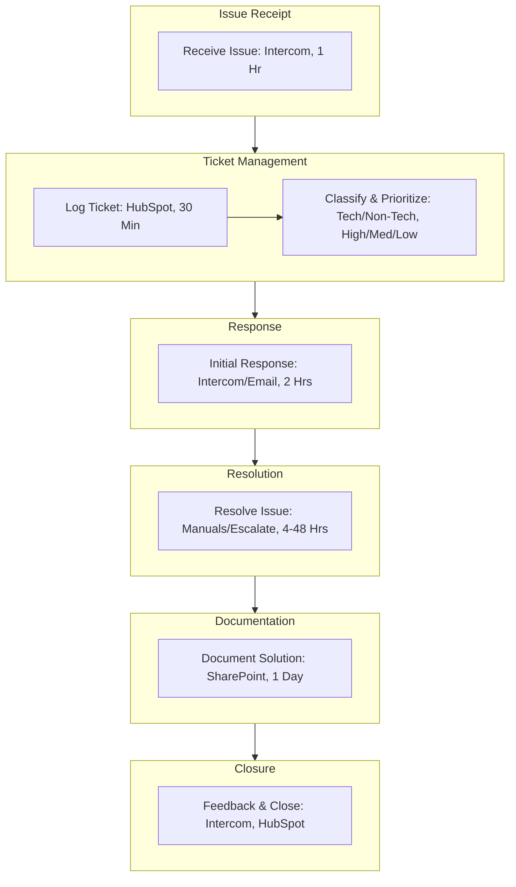

<Note>Last Updated: February 25, 2025</Note>

## Purpose
To standardize the receipt and handling of customer issues, improving efficiency and service quality.

## Scope
Applies to all Tech Support staff managing customer inquiries.

## Responsibility
Tech Support receives, processes, and resolves customer issues.

## Simple Flowchart
<Frame>

</Frame>

## Process Steps
<Steps>
  <Step title="Receive Issue">
    - Accept customer issues via Intercom within {one} hour of submission:
      - Note initial details: customer name (e.g., "Jane Doe"), product (e.g., "Glow"), and issue (e.g., "API error")
  </Step>

  <Step title="Log Ticket">
    - Create ticket in HubSpot within thirty minutes:
      - Enter customer details, issue description, and timestamp
      - Assign unique ticket ID (e.g., "TS-20250225-001") and link to customer profile
      - Attach screenshots or logs if provided by customer
  </Step>

  <Step title="Classify and Prioritize">
    - Assess within {one} hour:
      - Technical (e.g., Together Engine bug) or Non-Technical (e.g., billing query)
      - Set priority:
        - High (e.g., system down, less than ten percent users)
        - Medium (e.g., feature issue)
        - Low (e.g., question)
      - Tag ticket in HubSpot (e.g., "Tech-High", "Non-Tech-Low")
  </Step>

  <Step title="Initial Response">
    - Reply via Intercom or email within two hours of ticket creation:
      - Include ticket ID, expected next update (e.g., "By 3 PM"), and support contact
      - Log response time in HubSpot
  </Step>

  <Step title="Resolve Issue">
    - Use product manuals (e.g., Amadeus API guide) or escalate to specialist (e.g., FaceAR lead) within four hours:
      - Test fix (e.g., "API now returns 200 OK") and confirm with customer via Intercom
      - Resolve High priority in eight hours, Medium in twenty-four hours, Low in forty-eight hours
  </Step>

  <Step title="Document Solution">
    - Save solution in SharePoint knowledge base within {one} day:
      - Use format: `[Product]-[Issue]-[Date]-[Resolution]`
      - Link ticket ID to entry for reference
  </Step>

  <Step title="Collect Feedback and Close Ticket">
    - Ask customer via Intercom for resolution rating within {one} day of fix:
      - Close ticket in HubSpot after confirmation or forty-eight hours with no reply
      - Archive closed ticket data monthly
  </Step>
</Steps>

## Tools
<CardGroup cols="one">
  <Card title="Key Tools" icon="wrench">
    - **Intercom**: Customer issue submission and communication
    - **HubSpot**: Ticket logging, classification, and tracking
    - **SharePoint**: Knowledge base for solutions and documentation
    - **Slack**: Internal communication for escalations (optional)
    - **Email**: Customer notifications and support contact
  </Card>
</CardGroup>

<Warning>
  Ensure all customer issues are handled promptly to maintain service quality.
  Escalate unresolved issues via Slack `#tech-support` within {one} hour.
</Warning>

## Notes
<CardGroup cols="two">
  <Card title="Efficiency Focus" icon="clock">
    Prioritize quick issue resolution and clear communication to enhance customer satisfaction.
  </Card>
  
  <Card title="Integration" icon="link">
    Coordinate with [Tech_Support_Product_Specific_Technical_Manuals_SOP](SOP/Tech_Support/Tech_Support_Product_Specific_Technical_Manuals_SOP.mdx) to ensure product manuals support issue resolution.
  </Card>
</CardGroup>
