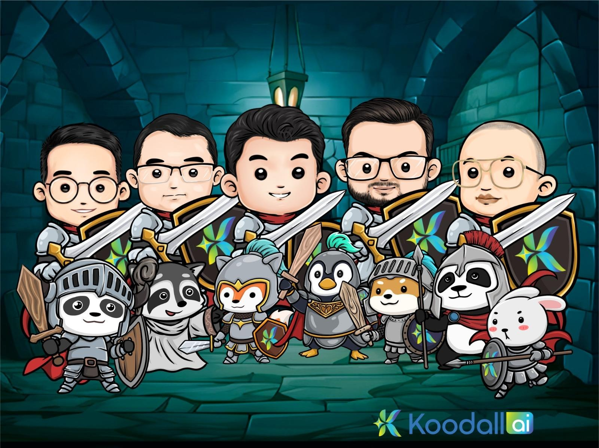

## Welcome to Koodall's Internal SOP Documentation

<Steps>
  <Step title="What is this?">
    - A centralized hub for Koodall's **Standard Operating Procedures (SOPs)** to ensure consistency, efficiency, and compliance.
    - Covers **HR, Sales, Marketing, IT, and Tech Support**, streamlining workflows for our remote-first team.
    - Use this guide for processes like **onboarding, sales demos, marketing campaigns, and IT support**.
  </Step>

  <Step title="Why It Matters">
    - SOPs **boost productivity, reduce errors, and align with Koodall's mission** to deliver innovative AI solutions (**Amadeus, FaceAR, Glow, Together Engine**).
    - They ensure all teams follow best practices for **client engagement, infrastructure stability, and operations**.
    - Regular updates keep processes optimized for our **remote-first, data-driven** approach.
  </Step>

  <Step title="How to Navigate">
    - **Use the left sidebar** to browse SOPs by department:
      - **👤 HR:** Onboarding, training, remote hiring.
      - **🤝 Sales:** B2B prospecting, demos, contracts.
      - **📣 Marketing:** Branding, data analysis, SME engagement.
      - **⚙️ IT:** Infrastructure, security, emergency responses.
      - **🎧 Tech Support:** Customer issues, manuals, support systems.
    - **Click an SOP** (e.g., `HR_Pre_Onboarding_Preparation_SOP`) to view step-by-step guides, tools, and flowcharts.
    - **Use the search bar (top-right)** to find specific processes (e.g., "HubSpot," "AWS").
  </Step>
</Steps>
